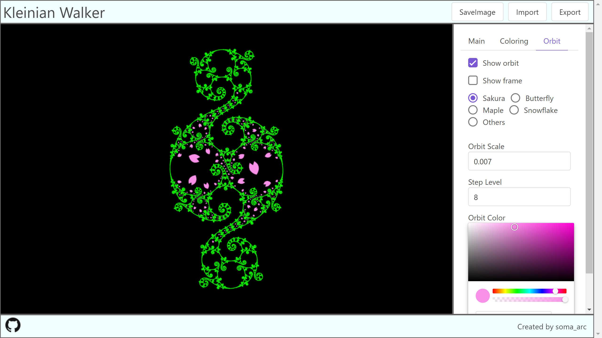
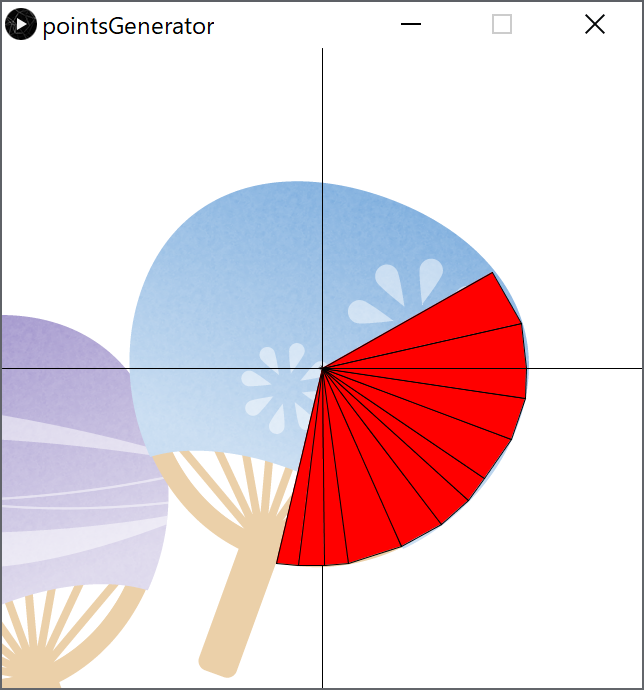

# KleinianWalkerWeb



Render the limit set of the Kleinian groups with a classical way referred from Indra's Pearls. Also, it renders orbits of figures. According to the parameter, it takes too much time to compute the limit set, and your browser may crash. Please use this application at your own risk.

URL: [https://soma-arc.net/KleinianWalkerWeb](https://soma-arc.net/KleinianWalkerWeb)  
Introductory video: [https://youtu.be/XnhvkhgxrCE](https://youtu.be/XnhvkhgxrCE)

## Run
```
$ cd kleinianWalkerWeb
$ npm install
$ npm start
# Access to localhost:8080
```

## Implementation
- Grandma Recipe
- Riley Recipe
- Jorgensen Recipe
- Sakugawa Recipe

### points generator 



There are four persets. They are Sakura, Butterfly, Maple, and Snowflake.
Figures of orbits is defined from points.
We can load csv file of points, and render original figures of orbits.
We prepare points generator. It can generate points file.


## Reference

- David Mumford, Caroline Series, and David Wright,
        Indra's Pearls: The Vision of Felix Klein


## Author
- soma_arc (Kento Nakamura)

## Copyright
Copyright (c) 2020 soma_arc (Kento Nakamura)

## License
Licensed under GPL-3.0
